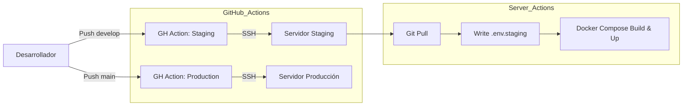

# Estrategia de CI/CD (GitHub Actions)

Esta implementación automatiza el ciclo de vida del software mediante flujos de trabajo en GitHub Actions, conectándose al servidor vía SSH.

## 1. Arquitectura del Pipeline

El flujo es "Push-to-Deploy": GitHub detecta el cambio, se conecta al servidor, actualiza el código, inyecta secretos y reconstruye los contenedores.

---

## 2. Workflows Propuestos

### A. `.github/workflows/staging.yml` (Develop)
*   **Trigger**: Push a `develop`.
*   **Pasos**:
    1.  Checkout código.
    2.  Conexión SSH.
    3.  `git pull origin develop`.
    4.  Creación de `envs/.env.staging` desde GitHub Secrets.
    5.  Ejecución de `docker compose -f ... staging.yml up -d --build`.

### B. `.github/workflows/production.yml` (Main)
*   **Trigger**: Push a `main`.
*   **Pasos**:
    1.  Checkout código.
    2.  Conexión SSH.
    3.  `git pull origin main`.
    4.  Creación de `envs/.env.production` desde GitHub Secrets.
    5.  Ejecución de `docker compose ... prod.yml up -d --build`.
    6.  Limpieza de imágenes antiguas (`docker image prune`).

---

## 3. Secretos Requeridos (GitHub Repo Settings)

Estos valores deben configurarse en el repositorio de GitHub (Settings -> Secrets and variables -> Actions):

| Nombre del Secreto | Descripción |
| :--- | :--- |
| `SSH_HOST` | IP o Dominio del servidor. |
| `SSH_USER` | Usuario del servidor (ej: `ubuntu` o `root`). |
| `SSH_PRIVATE_KEY` | Llave privada SSH para acceder sin contraseña. |
| `ENV_STAGING` | Contenido completo del archivo `.env.staging`. |
| `ENV_PRODUCTION` | Contenido completo del archivo `.env.production`. |

---

## 4. Checklist Operativo y de Uso Seguro

- [ ] **Llaves SSH**: La llave pública de GitHub Action debe estar en `~/.ssh/authorized_keys` del servidor.
- [ ] **Secretos**: Las variables `.env` NO deben estar en el repo, SÓLO en GitHub Secrets.
- [ ] **Protección de Ramas**: Configurar "Branch Protection Rules" en `main` para exigir que los checks pasen antes de mergear (opcional pero recomendado).
- [ ] **Rollback**: Si un deploy falla, GitHub Actions mostrará el error. El rollback es manual (revert commit) o re-ejecutar el job anterior exitoso.
